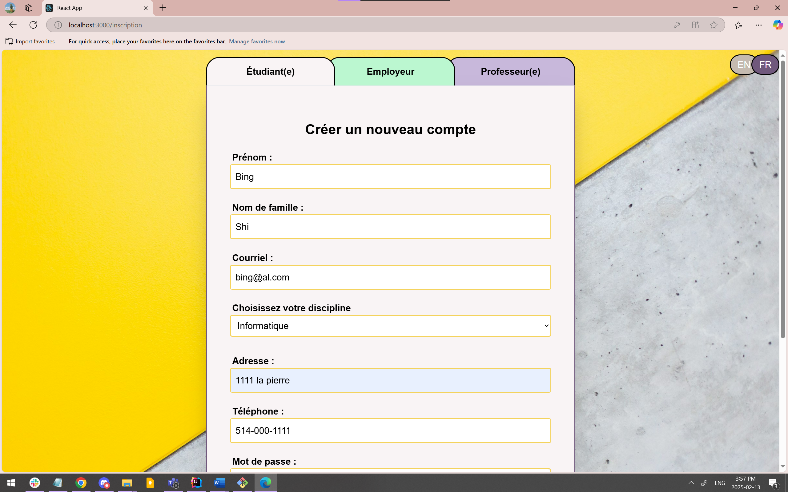
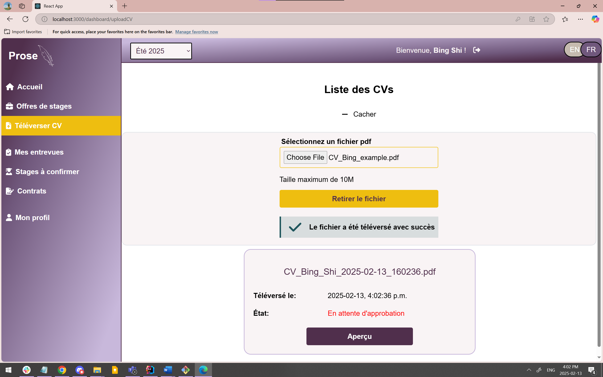
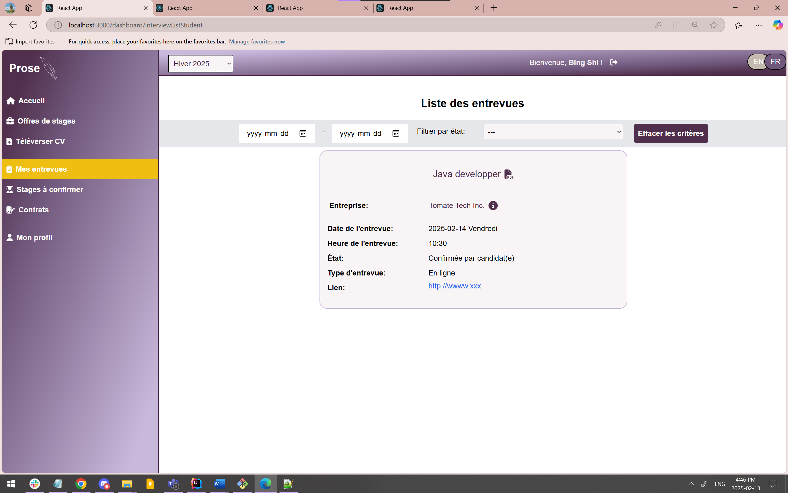
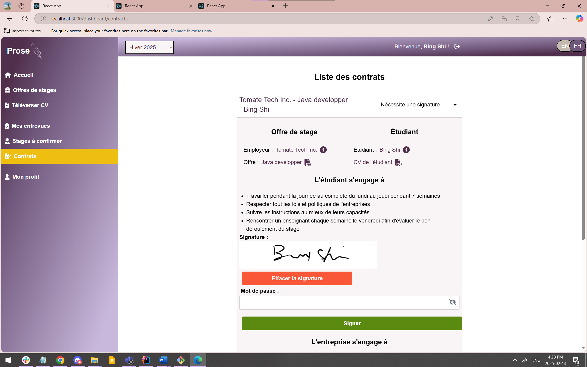
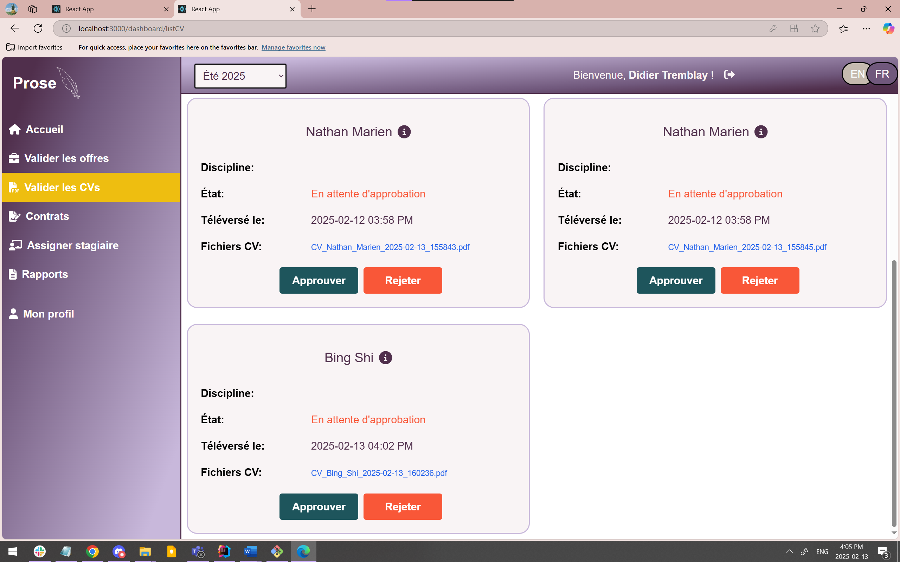
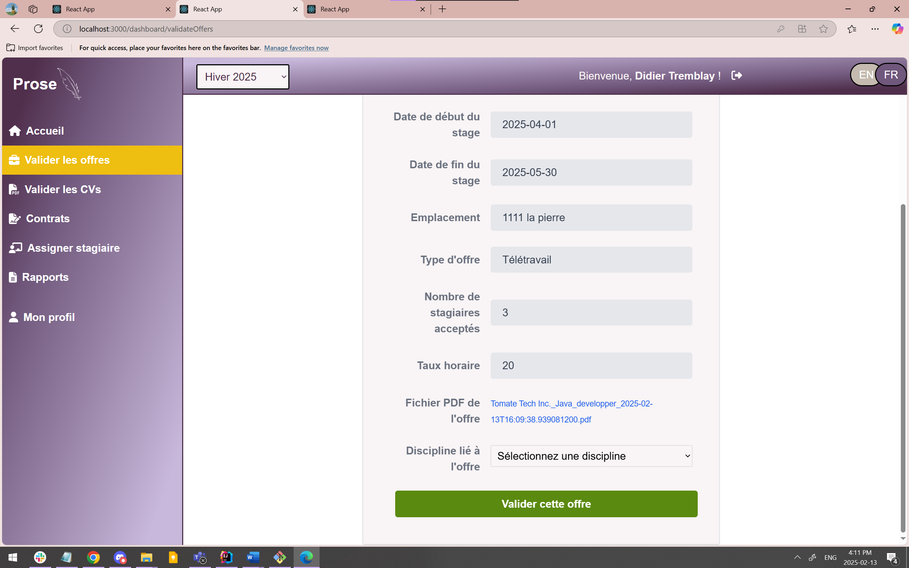
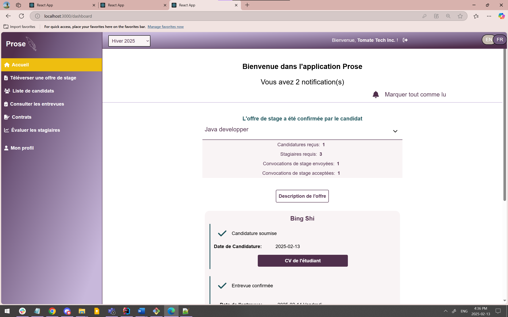
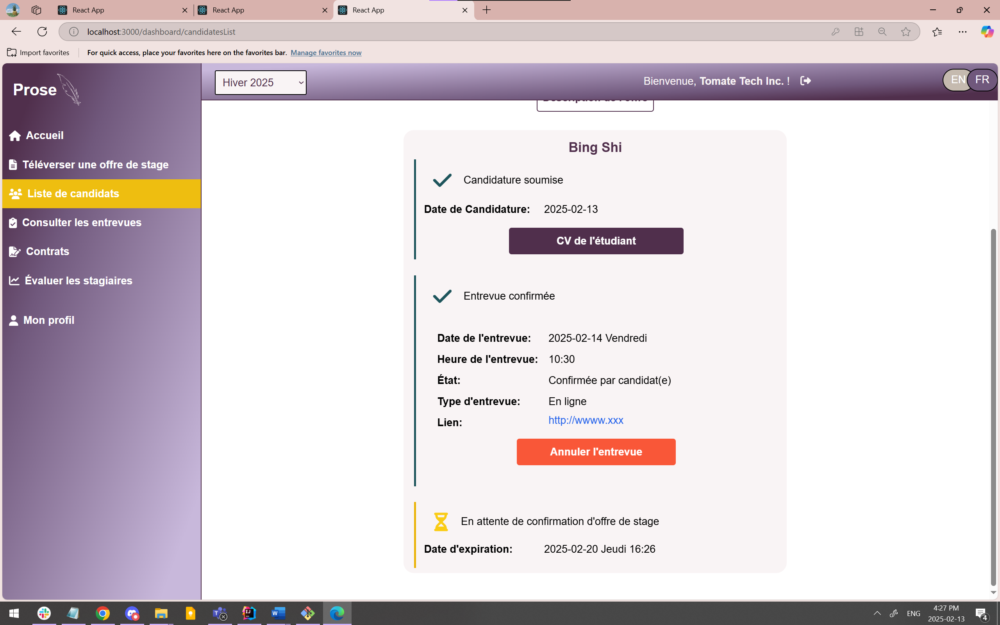
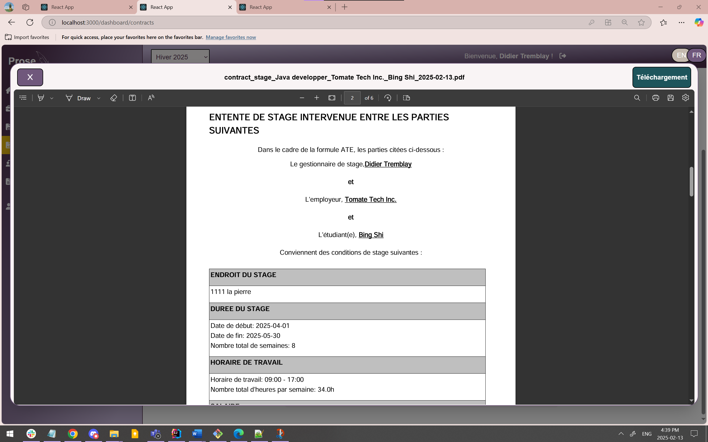
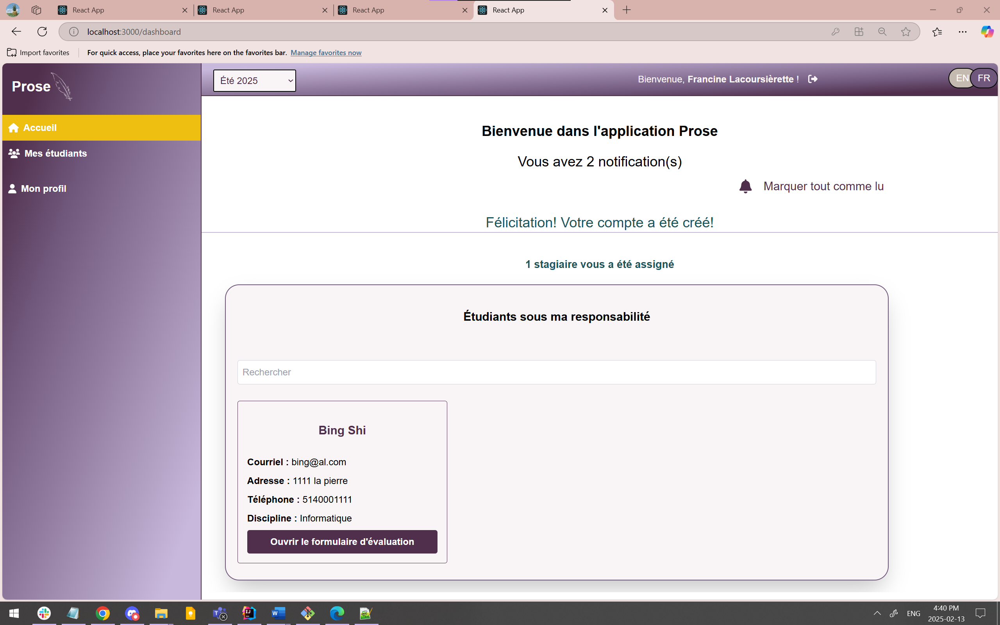

# internship-management
Development of a bilingual management system for internships Design and implementation of a complete platform for internship management, including user registration, posting offers, CV submission, interview scheduling, contract signing and report generation.

## Techologies: ## 
Java · JavaScript · Spring Boot · React.js · JWT · Spring Security · PostgreSQL · JUnit Test · Jest · Jira · Tailwind CSS · i18next · Maven

## Front-end: ##
Development of a responsive and multilingual user interface with React, JavaScript, Tailwind CSS and i18next.

## Back-end: ## 
Creation of robust APIs with Spring Boot, management of CRUD operations, securing data with JWT Token, and use of PostgreSQL for the database. Structuring the project with Maven.

## Testing: ##
Quality assurance via unit tests with JUnit and front-end integration tests with Jest.

## Teamwork experience: ##
Effective collaboration within an agile team using Jira, Scrum and advanced Git branch management.

## Structure diagram ## 

## Main functions and internship workflow ##
### Account & Profile Management
1. Create Account (Users: Student, Employer)
Description: Users register with the system, specifying their role.
2. Upload CV (Student)
Description: Students upload their curriculum vitae.
3. Profile Updates (All Users)
Description: Users can update their personal information.

### Internship Offer Management
1. Post Internship Offer (Employer)
Description: Employers create and submit internship offer details.
2. Validate Internship Offer (Admin)
Description: Admin reviews and approves internship offers for compliance.
3. Consult Internship Offers List (Student)
Description: Students browse available internship opportunities.

### Application & Interview Process
1. Apply for Internship (Student)
Description: Students submit applications to desired internships.
2. Consult List of Candidates (Employer)
Description: Employers review applications and candidate profiles.
3. Plan Interview / Cancel Interview (Employer)
Description: Employers schedule or cancel interviews with selected candidates.
4. Confirm Interview (Student)
Description: Students confirm their attendance to the scheduled interview.
5. Invitation for Internship (Employer)
Description: Employer sends an invitation to the selected candidate.

###  Internship Contract & Onboarding
1. Accept Internship / Refuse Internship (Student)
Description: Students accept or decline internship offers.
2. Starting the Contract Signing Process (Admin)
Description: Admins initiate the contract signing process.
3. Sign Contract (Student, Employer, Admin)
Description: All parties sign the internship contract.
4. Assign to Professor (Admin)
Description: Admin assigns a professor to monitor the student during the internship.

### Internship Evaluation & Reporting
1. Evaluation of Internship Environment (Professor)
Description: Professors evaluate the internship environment.
2. Evaluation of Intern (Employer)
Description: Employers evaluate the performance of the intern.
3. Consult Reports (Admin)
Description: Admins access and review internship evaluation reports.

## Example of screenshots ##

### Student role ###

### Admin role  ###

### Employer role  ###

### Professor role  ###
