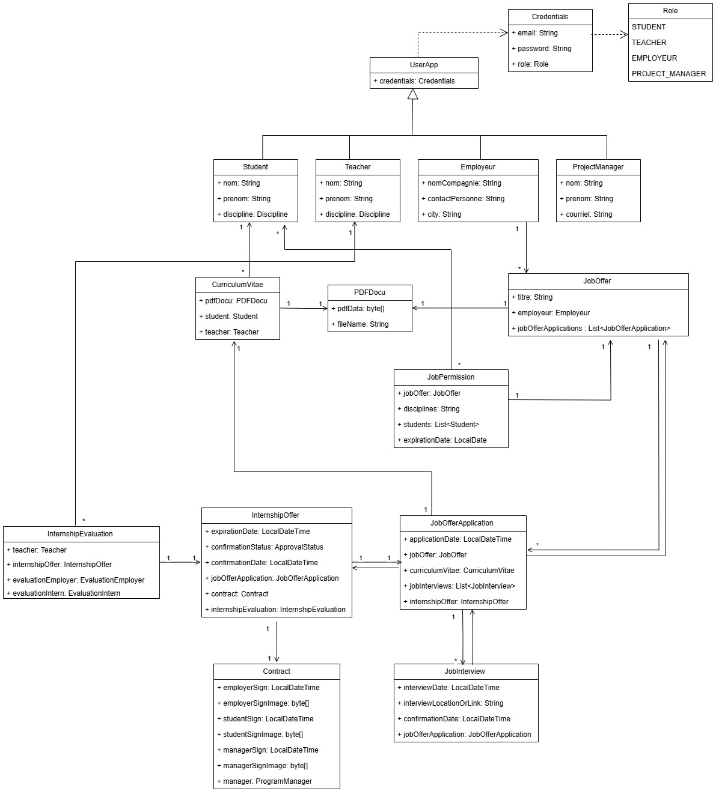

# internship-management
Development of a bilingual management system for internships Design and implementation of a complete platform for internship management, including user registration, posting offers, CV submission, interview scheduling, contract signing and report generation.

## Techologies: ## 
Java · JavaScript · Spring Boot · React.js · JWT · Spring Security · PostgreSQL · JUnit Test · Jest · Jira · Tailwind CSS · i18next · Maven

## Front-end: ##
Development of a responsive and multilingual user interface with React, JavaScript, Tailwind CSS and i18next.

## Back-end: ## 
Creation of robust APIs with Spring Boot, management of CRUD operations, securing data with JWT Token, and use of PostgreSQL for the database. Structuring the project with Maven.

## Testing: ##
Quality assurance via unit tests with JUnit and front-end integration tests with Jest.
Development of a bilingual management system for internships Design and implementation of a complete platform for internship management, including user registration, posting offers, CV submission, interview scheduling, contract signing and report generation. Front-end: Development of a responsive and multilingual user interface with React, JavaScript, Tailwind CSS and i18next. Back-end: Creation of robust APIs with Spring Boot, management of CRUD operations, securing data with JWT Token, and use of PostgreSQL for the database. Structuring the project with Maven. Testing: Quality assurance via unit tests with JUnit and front-end integration tests with Jest.

## Teamwork experience: ##
Effective collaboration within an agile team using Jira, Scrum and advanced Git branch management.

## Structure diagram ## 

